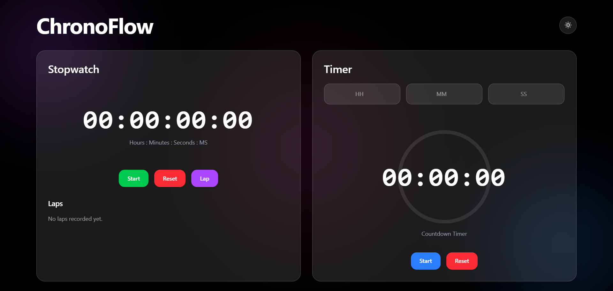

# ⏱ ChronoFlow

A modern Stopwatch and Timer application built with React, Tailwind CSS, and Framer Motion.

## ✨ Features

* Stopwatch

  * Start / Pause / Reset
  * Lap Tracking
  * Milliseconds Support

* Countdown Timer

  * Custom Time Input
  * Preset Timers
  * Circular Progress Ring
  * Completion Alert Sound

* Modern UI

  * Glassmorphism Design
  * Responsive Layout
  * Dark Mode
  * Smooth Animations

## 🚀 Tech Stack

* React
* Vite
* Tailwind CSS
* Framer Motion
* Lucide React

## 📸 Screenshots



## ⚡ Installation

```bash
npm install
npm run dev
```

## 🌍 Live Demo
(https://chronoflow-nu.vercel.app/)

## 📂 GitHub Repository

(https://github.com/mudassir-jmi/chronoflow)
